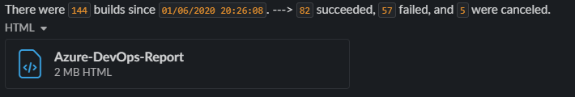
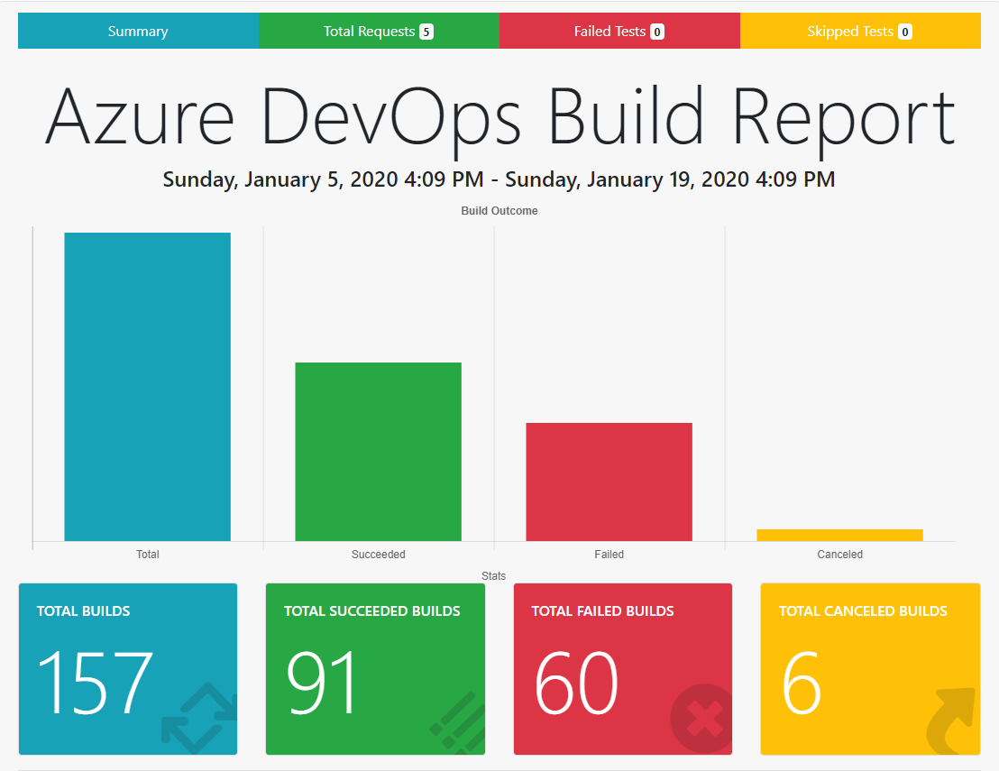

# AzureDevOps.Postman

Additional context to this repository can be found in the companion blog posts here: [Part 1](https://www.esmith.dev/posts/share-azuredevops-stats-in-slack-using-a-postman-collection-part1/) and [Part 2](https://www.esmith.dev/posts/share-azuredevops-stats-in-slack-using-a-postman-collection-part2/)

This project uses a Postman collection to pull Build stats out of Azure DevOps via the Rest API, runs that Postman collection with the Newman CLI, and then sends a customized HTML report and message via Slack. All wrapped in a generalized Azure pipeline.



The HTML report is extended via a ```{{handlebar template}}``` from the awesome [htmlextra](https://github.com/DannyDainton/newman-reporter-htmlextra) project, and includes a visualization of build stats, inspired by the postman visualize feature. The HTML report turns out looking like this.




## tldr + Just want to try it

The **Azure Pipeline** drives:

Postman Collection --> Newman --> HTML Report + Json Report --> Slack Message with build stats over the last 14 days

If you want to see it in action against your Azure DevOps collection.

1. Clone the repo and create a new pipline pointing it at the [azure-pipelines.yml](azure-pipelines.yml)
2. Update the slack channel name to send the message to in the ```slackChannel``` Pipeline Variable
3. Create a secret variable to hold your ```slackToken``` $(slackToken)


## ldr + Some more credits

- Credit to [this repository containing an Azure DevOps Collection by hkamel](https://github.com/hkamel/azuredevops-postman-collections) for the base collection and starting environment config
- Credit to the awesome [htmlextra](https://github.com/DannyDainton/newman-reporter-htmlextra) project for the html inspiration and {{handlebars}}
- I recommend opening the [postman_collection.json](AzureDevOps.Postman.postman_collection.json) and [postman_environment.json](AzureDevOpsEnvironment.postman_environment.json) files directly in postman if you want to look around a bit at the request and test definition
- Within the requests a *pre-request* script creates a date to use for the minimum time (14 days) and places it in an environment variable
- Within the requests there are *test* scripts which create environment variables for the different build stats that are consumed in the report and slack message
- The Postman Collection and Environment file have been exported and generalized
- Additional context here: [Part 1](https://www.esmith.dev/posts/share-azuredevops-stats-in-slack-using-a-postman-collection-part1/) and [Part 2](https://www.esmith.dev/posts/share-azuredevops-stats-in-slack-using-a-postman-collection-part2/)
